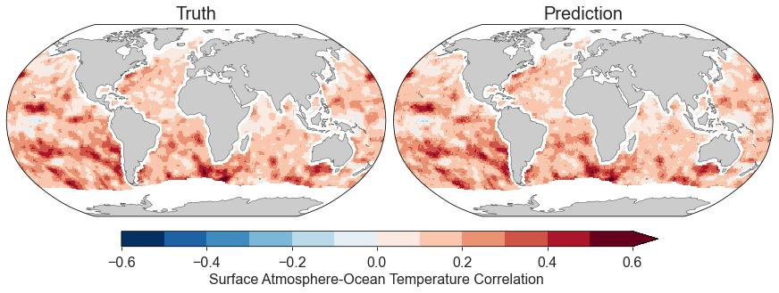
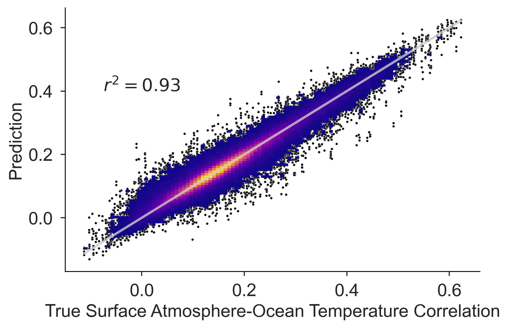

# Machine Learning for estimating Cross Domain Covariance (&amp; Correlation) relationships in coupled atmosphere-ocean DA systems

## Proof of Concept

As a proof of concept, we use a feedforward neural network to predict the
surface atmosphere-ocean temperature correlation structure.
The main idea is to use the neural network to extend the statistical
significance of a small ensemble.
The truth is derived from an 80 member ensemble run, and as a first step we have
removed coastal points and regions covered by sea ice.
At a given location, the neural network makes a prediction based on the
following features (which we can definitely optimize further!):
- Atmosphere: 2 meter humidity, 2 meter temperature, sensible heat flux due to rainfall, total precip, surface horizontal wind speed
- Ocean: SST, surface height, horizontal surface speed, barotropic current speed, mixed layer depth, mean eddy kinetic energy

Each "feature" is taken as a small-ensemble average, which, for now, is derived from 20
member subsets.
For details on the neural network architecture, see
[notebooks/surface_feedforward_regression.ipynb](notebooks/surface_feedforward_regression.ipynb).

 

The map shows the true and predicted surface temperature correlation field.
The plot on the right indicates prediction skill, showing a bivariate histogram
between the predicted and true data (colormap).
The histogram contains 99% of the data, and the final 1% is represented by the
scatter plot.
The faint gray line indicates the 1:1 line where prediction = truth.

These specific results are generated by a KFold approach, see
[notebooks/surface_feedforward_regression_kfold.ipynb](notebooks/surface_feedforward_regression_kfold.ipynb)
for details.


## Using this package
Create environment with

```python

conda env create -f environment.yaml
```

And add to path with

```python
import sys
sys.path.append("/path/to/mlcdc")
```

Eventually, we'll move this to pip/conda-forge.
